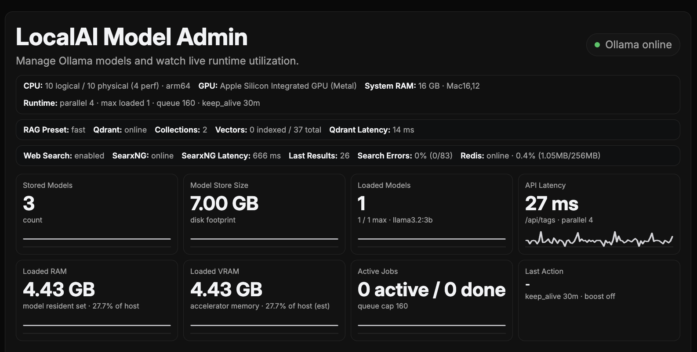

# localai-orchestrator

macOS-first orchestration for Apple Silicon: run Ollama natively (Metal path) and run UI/services in Docker.

## Documentation Map

- Quick start and project overview: this README
- CLI flags and startup modes: `docs/CLI.md`
- Networking, exposure, and endpoint behavior: `docs/NETWORKING.md`
- Stack configuration, RAG, web-search, and tuning: `docs/STACK_CONFIGURATION.md`
- Model Admin behavior and debug console: `docs/MODEL_ADMIN.md`
- Computer vision + image generation roadmap: `docs/COMPUTER_VISION_UPGRADE_PATH.md`
- Runtime files and troubleshooting: `docs/OPERATIONS.md`

## What It Does

- Starts `ollama serve` as a macOS `launchd` service
- Runs OpenWebUI + Model Admin + Qdrant via Docker Compose
- Optionally enables web-search add-ons (SearxNG + Redis)
- Auto-tunes runtime defaults from detected host hardware
- Provides one CLI for lifecycle, checks, model sync, and warmup

## Screenshot



## Why This Architecture

Docker on macOS does not give Linux containers native Apple Metal acceleration. This project keeps Ollama on the macOS host for performance, while using Compose for UI and supporting services.

## Requirements

- macOS on Apple Silicon (`arm64`)
- Python `3.11+`
- [Ollama](https://ollama.com/) installed and available in `PATH`
- Docker Desktop (or compatible Docker engine) running

## Quick Start

```bash
cd localai-orchestrator
python3 -m venv .venv
source .venv/bin/activate
pip install setuptools wheel
pip install .

localai doctor
localai up --sync-models --warmup
```

When you change local source code and want `localai` to pick it up:

```bash
source .venv/bin/activate
pip install --no-build-isolation .
```

First run notes:

- `--sync-models` pulls all models listed in `stack.toml` (`[native.ollama].models`).
- First-time model downloads can take a while.
- Python 3.14 users should prefer `pip install .` or `pip install --no-build-isolation .` (avoid editable install in this repo).

## Common Commands

```bash
# Start full stack
localai up --sync-models --warmup

# Stop docker services
localai down

# Status and diagnostics
localai status
localai doctor
localai logs --tail 200
```

For full command/flag behavior, see `docs/CLI.md`.

## Project Structure

- `localai/`: Python CLI + orchestration logic
- `model_admin/`: FastAPI app for model management UI
- `image_gen/`: FastAPI service lane for async image generation jobs
- `docs/`: operational and feature documentation
- `docker-compose.yml`: OpenWebUI + model-admin + qdrant services
- `stack.toml`: user-tunable stack configuration
