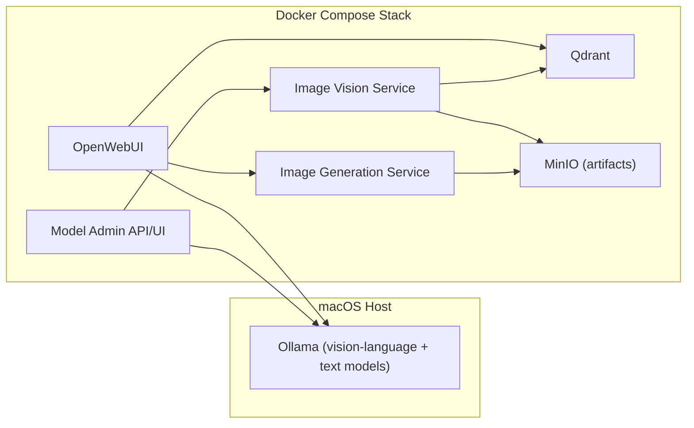

# Computer Vision Upgrade Path

This plan extends the current architecture to support:

- Robust vision ingestion and evaluation (image-in workloads)
- A dedicated image generation service lane (image-out workloads)

## Current Baseline

- Ollama runs natively on macOS for Metal acceleration.
- OpenWebUI, Model Admin, and Qdrant run in Docker Compose.
- Model Admin supports pull/inventory/catalog and text generate/smoke/benchmark flows.
- Vision models are discoverable in catalog filters, but there is no first-class image-input testing pipeline.
- There is no dedicated image-generation worker, API, or artifact storage lane.

## Target Architecture

## Lane A: Vision Ingestion + Benchmarking

### A1. API Surface

Add Model Admin endpoints:

- `POST /api/vision/analyze`
- `POST /api/tests/vision-smoke`
- `POST /api/tests/vision-benchmark`

Request shape (initial):

- `model` (vision-capable model tag)
- `image` (base64 or URL; base64 first for simplicity)
- `prompt` (default task prompt)
- Optional `ground_truth` for scored benchmarks

Response shape:

- `duration_ms`, `tokens`, `eval_count`, `eval_duration`
- Parsed output payload and raw model response
- Optional benchmark score fields (exact match/F1/task-specific)

### A2. Model Capability Gating

Implement capability checks before running vision tests:

- Extend model metadata in catalog items with `capabilities` (`text`, `vision_in`, `tool`, etc.).
- Add a capability probe in Model Admin (`/api/show` or model metadata heuristic fallback).
- Fail fast with actionable error if a non-vision model is used for image tasks.

### A3. Dataset + Fixtures

Create a local benchmark fixture bundle:

- `tests/fixtures/vision/*.jsonl` for prompt + expected output
- `tests/fixtures/vision/images/*` for deterministic test images

Task slices for v1:

- OCR-like extraction
- Chart/table reading
- UI screenshot interpretation
- Simple object attribute extraction

### A4. Benchmark Runner

Add runner and metrics in Model Admin:

- Per-sample latency and throughput
- Success rate by task type
- Structured score by evaluator function
- Summary stats (avg/p95 latency, pass rate)

Store benchmark results:

- Initial: in-memory + downloadable JSON
- Next: persist to a lightweight local store (SQLite or JSON file in mounted volume)

### A5. CLI Integration

Extend CLI with:

- `localai test vision-smoke --model <model>`
- `localai benchmark vision --model <model> --dataset <path>`

Reuse existing benchmark patterns for output formatting and JSON export.

## Lane B: Image Generation Service

OpenWebUI is the primary image-generation user interface. Model Admin remains operations-only and does not host image-generation UX.

### B1. Service Boundary

Introduce a new service (`image-gen`) in Compose:

- FastAPI worker with queue-backed job execution
- Endpoints:
  - `POST /api/images/generate`
  - `GET /api/images/jobs/{id}`
  - `GET /api/images/assets/{id}`

Why separate lane:

- Different runtime profile and reliability concerns vs text/vision inference
- Enables async job handling and retries without blocking OpenWebUI flows

### B2. Backend Options

Phase approach:

- Phase 1: provider adapter abstraction with a single local backend
- Phase 2: optional backends (ComfyUI, Diffusers runtime, external API provider)

Adapter contract:

- `submit(prompt, negative_prompt, size, steps, seed) -> job_id`
- `status(job_id) -> queued|running|done|failed`
- `result(job_id) -> artifact metadata`

### B3. Queue + Execution

Add Redis-backed queue (reuse existing optional Redis service or dedicated queue config):

- Concurrency limits
- Per-job timeout
- Retry policy for transient failures
- Cancellation support (nice-to-have in v1.1)

### B4. Artifact Storage

Add object storage lane for outputs:

- MinIO service in Compose for local-first artifact persistence
- Save generated files + metadata manifest
- Signed/local URLs returned to client

Metadata fields:

- prompt, model/backend, seed, size, steps, timestamp, duration, status

### B5. OpenWebUI Integration (Primary UX)

Integrate image generation directly in OpenWebUI:

- Prompt form and generation controls in OpenWebUI
- Jobs/history panel in OpenWebUI
- Result gallery in OpenWebUI with artifact metadata

Keep Model Admin scope limited to operations:

- Health/readiness for `image-gen`, queue, and storage
- Optional read-only metrics cards
- No generation form or direct image-generation actions

## Stack and Config Changes

## `stack.toml`

Add sections:

- `[vision]`:
  - `enabled`
  - `default_model`
  - `max_image_mb`
  - `benchmark_dataset`
- `[image_gen]`:
  - `enabled`
  - `provider`
  - `concurrency`
  - `queue_timeout_seconds`
  - `artifact_store = "minio"`

## `docker-compose.yml`

Add services:

- `image-vision` (optional if Model Admin handles vision directly)
- `image-gen`
- `minio`

Optional:

- If Redis is currently conditional by web-search, decouple queue Redis from web-search Redis for clearer failure domains.

## Security and Operations

- Enforce file size/type limits on image uploads.
- Run content checks before persisting generated artifacts.
- Add auth guard parity with existing Model Admin auth.
- Add retention policy for generated assets and logs.
- Add observability counters:
  - queue depth
  - job success/failure rate
  - p95 generation latency
  - storage used

## Rollout Plan

1. Phase 0 (1-2 days)
- Add config scaffolding and feature flags (`vision.enabled`, `image_gen.enabled`).
- Add API stubs and contract tests.

2. Phase 1 (3-5 days)
- Ship vision smoke + benchmark endpoints with fixture dataset.
- Add CLI commands and Model Admin test UI support.

3. Phase 2 (4-7 days)
- Ship image-gen service with async jobs and artifact persistence.
- Add OpenWebUI generation UX and operational metrics.

4. Phase 3 (2-4 days)
- Hardening: retries/timeouts, auth, retention, benchmark baselining.

## Acceptance Criteria

Vision lane is complete when:

- Can run deterministic vision smoke tests locally.
- Can benchmark at least 20 fixture samples and export JSON results.
- Benchmarks include latency and task-level scoring.

Image generation lane is complete when:

- Can submit generation jobs asynchronously and poll status.
- Generated assets persist and are retrievable after service restart.
- Service exposes health + queue + storage metrics.

## Immediate Next Changes (Codebase-Specific)

1. Extend `model_admin/app.py` request models and endpoints for vision tests.
2. Add test fixtures and tests under `tests/` for vision smoke/benchmark APIs.
3. Add CLI subcommands in `localai/cli.py` for vision testing.
4. Add `image-gen` and `minio` service definitions in `docker-compose.yml` behind env flags.
5. Wire OpenWebUI to `image-gen` APIs for generation, job status, and artifact retrieval.
6. Add new config dataclasses/parsing in `localai/config.py` and docs updates.
