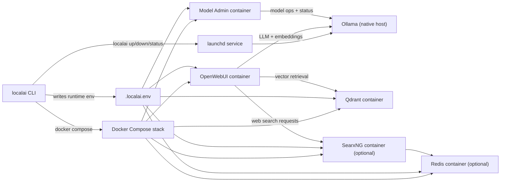

# Stack Configuration

Main config file: `stack.toml`

## Architecture Overview



## RAG Storage (Qdrant)

Qdrant is included as a default service for local RAG/vector storage.

- Container: `localai-qdrant`
- API port: `6333` (or `LOCALAI_QDRANT_PORT`)
- Data persistence: Docker named volume `qdrant-data`
- Optional auth: set `QDRANT_API_KEY` in `.env`
- Auto-tuned at startup from host specs, with boost-aware profile on `localai up --boost`
- Manual overrides available in `stack.toml` under `[rag.qdrant]`

OpenWebUI is pre-wired for RAG:

- `VECTOR_DB=qdrant`
- `QDRANT_URI=http://qdrant:6333`
- `RAG_EMBEDDING_ENGINE=ollama`
- `RAG_EMBEDDING_MODEL=nomic-embed-text` (override with `LOCALAI_RAG_EMBED_MODEL`)
- `RAG_TOP_K`, `CHUNK_SIZE`, `CHUNK_OVERLAP`, and `ENABLE_RAG_HYBRID_SEARCH` are set from the selected preset (`fast` by default)

Default model sync includes:

- `llama3.2:3b`
- `nomic-embed-text`

Persistence note:

- Qdrant collections/vectors persist across container rebuilds/restarts.
- Data is removed only if you explicitly remove volumes (for example `docker compose down -v`).

## Web Search (SearxNG + Redis)

Web search is optional and disabled by default.

Enable in `stack.toml`:

```toml
[web]
enabled = true
engine = "searxng"
searxng_query_url = "http://searxng:8080/search?q=<query>&format=json"

[web.redis]
maxmemory_mb = 512
```

Behavior:

- When `[web].enabled = true`, `localai up` includes `searxng` automatically.
- When web search is enabled, `localai up` includes `redis` automatically.
- `localai up --no-webui` skips OpenWebUI and web-search add-ons.
- OpenWebUI env wiring is auto-generated in `.localai.env`.

## Key Sections in `stack.toml`

- `[native.ollama]`: host/port, models, warmup defaults, optional manual runtime overrides
- `[docker]`: compose file and service list
- `[rag]`: RAG preset (`fast` or `deep`) used for OpenWebUI retrieval defaults
- `[rag.qdrant]`: qdrant enable/disable and optional manual tuning overrides
- `[web]`: web-search enablement and OpenWebUI/SearxNG defaults
- `[web.redis]`: Redis cache sizing policy for web-search workloads
- `[health]`: health-check URLs
- `[tuning]`: auto-tuning behavior

Health URLs:

- `openwebui_url`
- `qdrant_url`

## Auto-Tuning

On `localai up`, host hardware is detected and these are auto-derived:

- `num_parallel`
- `max_loaded_models`
- `keep_alive`
- `OLLAMA_MAX_QUEUE`
- Qdrant `default_segment_number`
- Qdrant `memmap_threshold_kb`
- Qdrant `indexing_threshold_kb`
- Qdrant `hnsw_m`
- Qdrant `hnsw_ef_construct`
- Web search `result_count`
- Web search request/loader concurrency
- Web search request timeout
- Redis `maxmemory_mb` (when web search is enabled)

Default policy:

```toml
[tuning]
enabled = true
respect_user_values = true
```

If you set manual values in `[native.ollama]`, `[rag.qdrant]`, `[web]`, or `[web.redis]` and keep `respect_user_values = true`, your values win.

RAG preset persistence note:

- OpenWebUI stores retrieval settings in its own persistent DB.
- `--rag-preset` (or `[rag].preset`) applies startup defaults, mainly for fresh setups.
- If you already changed retrieval settings in the OpenWebUI UI, those saved values may override env defaults until you change/reset them in UI.
